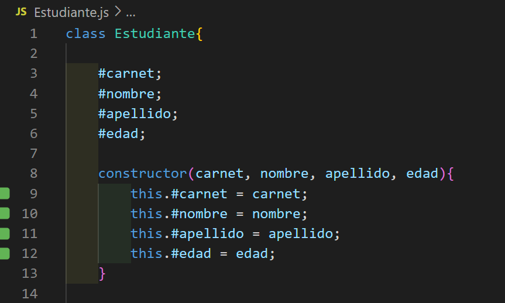
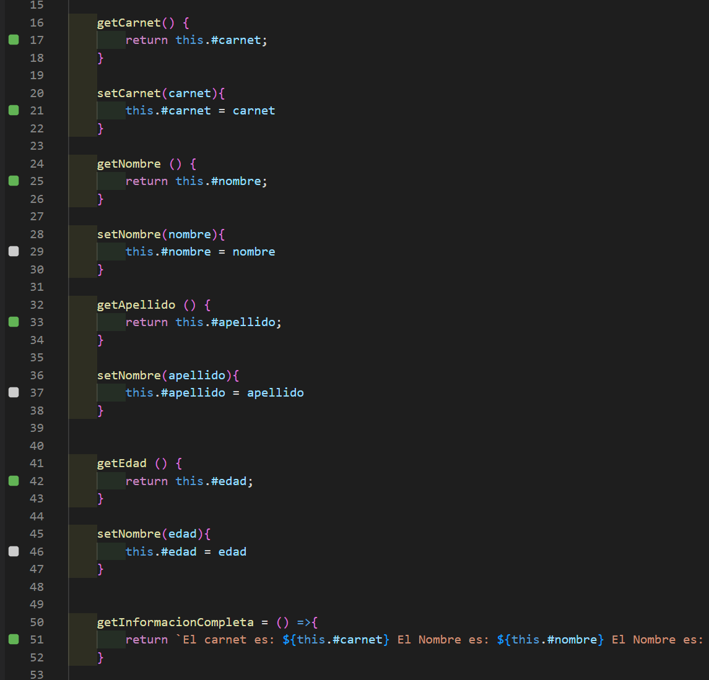
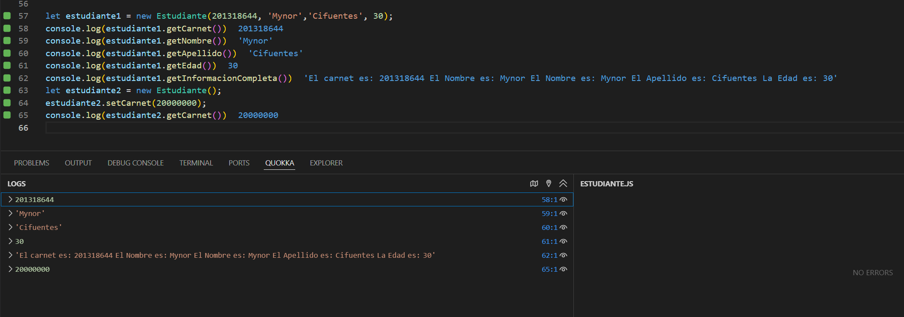

# POO_JavaScript

Este ejercicio consistió en crear una clase que representó un objeto de la vida real, definiendo sus propiedades clave y algunos métodos con los que se interactuó con él. 

Se utilizaron funciones flecha para algunos métodos además de dos instancias (objetos) 

## Especificaciones
* Atributos publicos o privados
* Un constructor
* Al menos dos métodos

Se muestra acontinuación las variables delcaradas privadas y su inicialización en el método constructor

Se muestran algunos métodos get y set para mostrar un pooco del encapsulamiento y para colocar algunos métodos

Se muestra de igual manera dos objetos con diferentes formas para utilizarse así como las respectivas salidas

